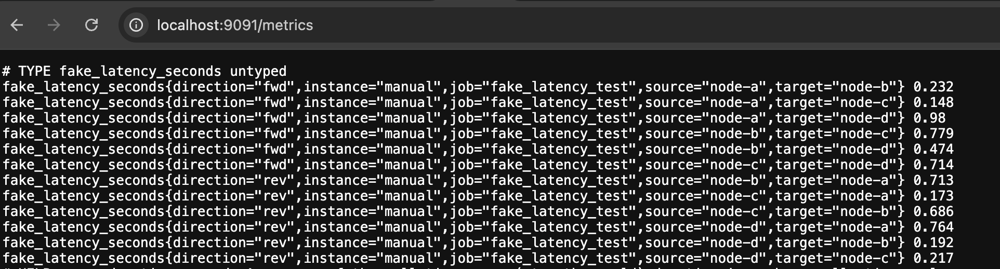
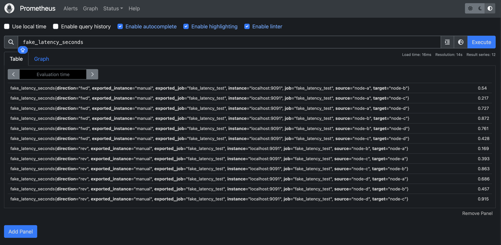
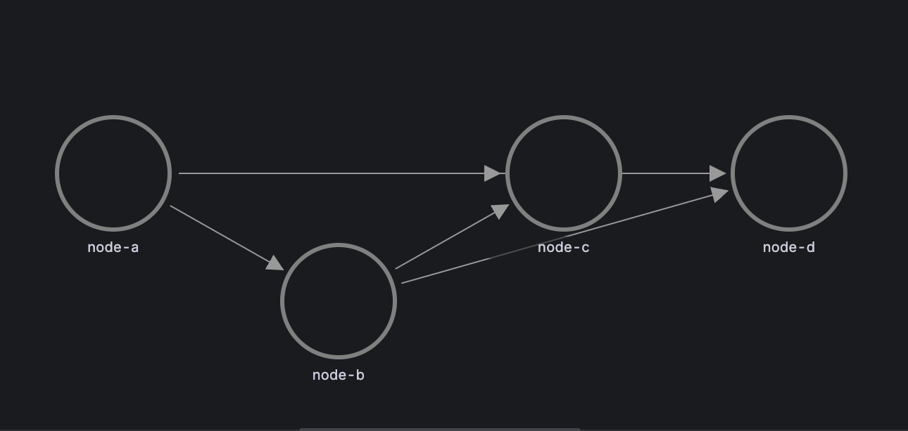
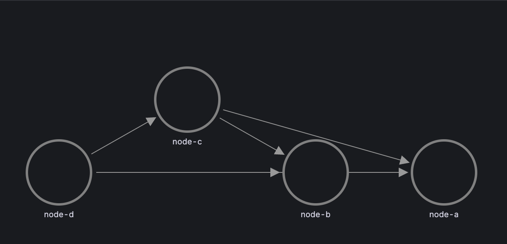
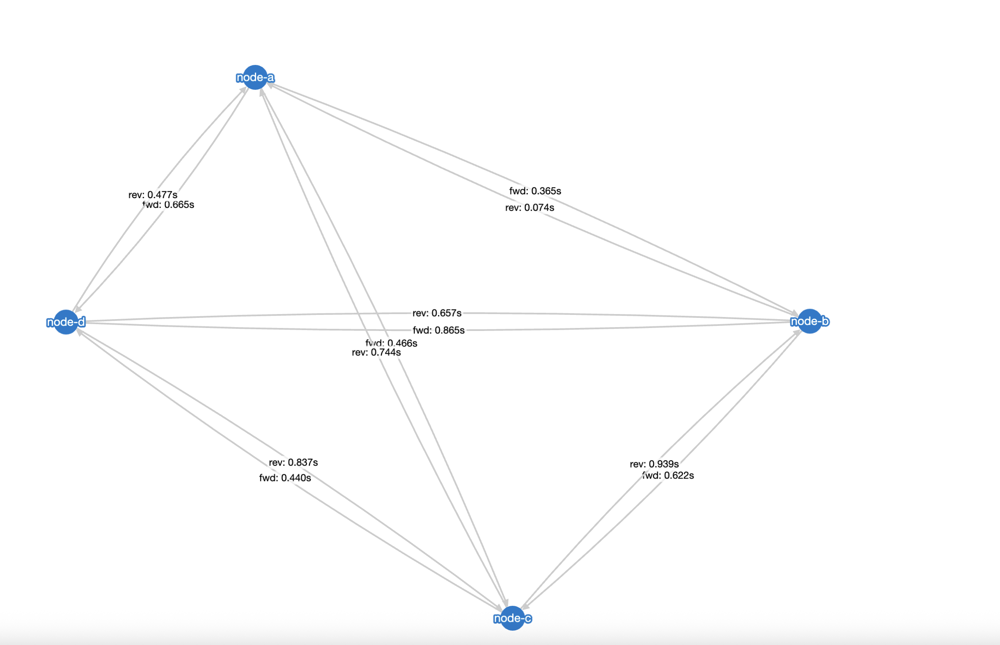

# Statement of Need

Modern robotic deployments often consist of multiple distributed ROS 2 nodes exchanging time-sensitive messages. Diagnosing latency across these nodes is critical for ensuring real-time performance and debugging network-induced delays.

While **Prometheus** and **Grafana** are widely used in cloud-native observability pipelines, their default tools are not specifically designed for robotics communication. In particular, the **Grafana Node Graph panel** has three major limitations when used for ROS 2 latency visualization:

1. **Bidirectional Blindness**: A→B and B→A communication are collapsed into a single bidirectional edge (A↔B), making it impossible to distinguish direction-specific delays.
2. **Over-Simplified Layout**: In nontrivial graphs, Grafana may auto-hide edges to simplify visualization, resulting in information loss.
3. **Missing Edge Metrics**: Latency values cannot be rendered directly on edges, hindering quick visual inspection.

These issues make it difficult to perform detailed communication analysis, especially in latency-sensitive workloads like multi-robot coordination, cloud offloading, or real-time planning loops. While tools exist for static ROS graph visualization, few integrate with **Prometheus**, and none offer real-time latency visualization embedded in cloud observability tools.

---

# Implementation  

The **ROS 2 Latency Visualizer** is implemented as a dual-mode pipeline for collecting, exposing, and visualizing inter-node latency metrics. It consists of two main components:  

### 1. Python-based Latency Injector  
This component generates either synthetic or real latency data and encodes it in the **Prometheus exposition format**. The metrics are then **pushed to a Prometheus Pushgateway**, from which **Prometheus scrapes the data**. Finally, **Grafana queries Prometheus** to retrieve the metrics and render them as time-series visualizations.  

In short, the data flow is: 
```text
Python Injector → Pushgateway → Prometheus → Grafana
```


### 2. Visualization Frontends  
Two visualization options are provided, supporting different levels of complexity and insight:  

#### Option 1: Grafana Node Graph Dashboard  
A lightweight dashboard is included using Grafana’s built-in **Node Graph panel**. This option is suitable for small or symmetric topologies, providing basic latency monitoring.  

A partial workaround for Grafana’s directional limitation is supported: users can toggle queries (e.g., `direction="fwd"` or `direction="rev"`) to display one direction at a time. However, this does not support simultaneous bidirectional viewing or direct edge-level latency annotations.  

#### Option 2: Cytoscape.js Visualizer  
To overcome the limitations of the native Grafana panel, a standalone **Cytoscape.js-based visualizer** is provided. It runs as a lightweight local web server and can be accessed directly, or linked from the Grafana dashboard.  

#### Why Option 2 is Essential  
The Cytoscape.js frontend resolves Grafana’s structural limitations by offering:  

- ✅ **True bidirectional visualization**: A→B and B→A appear as separate directed edges  
- ✅ **Simultaneous viewing**: Both directions and their latency values are visible at once  
- ✅ **Complete topological context**: No edges are hidden in complex graphs  
- ✅ **Interactive exploration**: Users can pan, zoom, and dynamically inspect connections  

This makes it particularly valuable for developers dealing with **asymmetric latencies**, **dynamic node relationships**, or **exploratory performance tuning**.  

---

### Example  

A sample script, `ros2_latency_injector.py`, is included to simulate latency metrics in the absence of real ROS 2 deployments.  

The pipeline works as follows:

1. The script pushes metrics to the **Prometheus Pushgateway**:  
   

2. **Prometheus** scrapes the metrics from the Pushgateway port:  
    

3. **Grafana** queries Prometheus to retrieve the metrics and render visualizations.  

### Visualizations

#### Grafana Node Graph Dashboard  

- Forward direction (`fwd`):  
   

- Reverse direction (`rev`):  
   

#### Cytoscape.js Visualizer  

- Both directions displayed simultaneously, with interactive exploration:  
  

### Future Work  
While the current implementation focuses on static inter-node latency measurements using a simulated or periodically pushed dataset, several promising extensions are planned:

- **Live ROS 2 Integration**: Direct integration with `rclpy` or `rclcpp` nodes to extract real latency metrics from actual ROS 2 message traffic.
- **Time-Series Tracking**: Enabling temporal analysis of latency changes over time, with Grafana panels showing historical latency trends.
- **Pod-to-Pod and Cloud-to-Edge Monitoring**: Applying the same pipeline in Kubernetes-based ROS 2 deployments, useful for cloud robotics and fog computing setups.
- **Alerting and Threshold Rules**: Supporting Prometheus alert rules and Grafana annotations to flag abnormal latency spikes or drops.
- **Topology-Aware Layouts**: Enhancing the Cytoscape.js visualizer to reflect physical or logical network structures (e.g., by namespace or domain).

These additions would help generalize the visualizer as a more comprehensive performance tool for real-time, distributed robotics systems.

  
# Acknowledgements
The author would like to thank the ROS 2, Prometheus, and Grafana open-source communities for providing the underlying infrastructure, as well as the Cytoscape.js project for enabling lightweight graph-based rendering in web browsers.  

# References

- ROS 2: Robot Operating System. [https://docs.ros.org/en/rolling/index.html](https://docs.ros.org/en/rolling/index.html). Accessed: 2025-08-28.
- Prometheus Monitoring. [https://prometheus.io/](https://prometheus.io/). Accessed: 2025-08-28.
- Grafana Observability Platform. [https://grafana.com/](https://grafana.com/). Accessed: 2025-08-28.
- Cytoscape.js Graph Theory Library. [https://js.cytoscape.org/](https://js.cytoscape.org/). Accessed: 2025-08-28.


